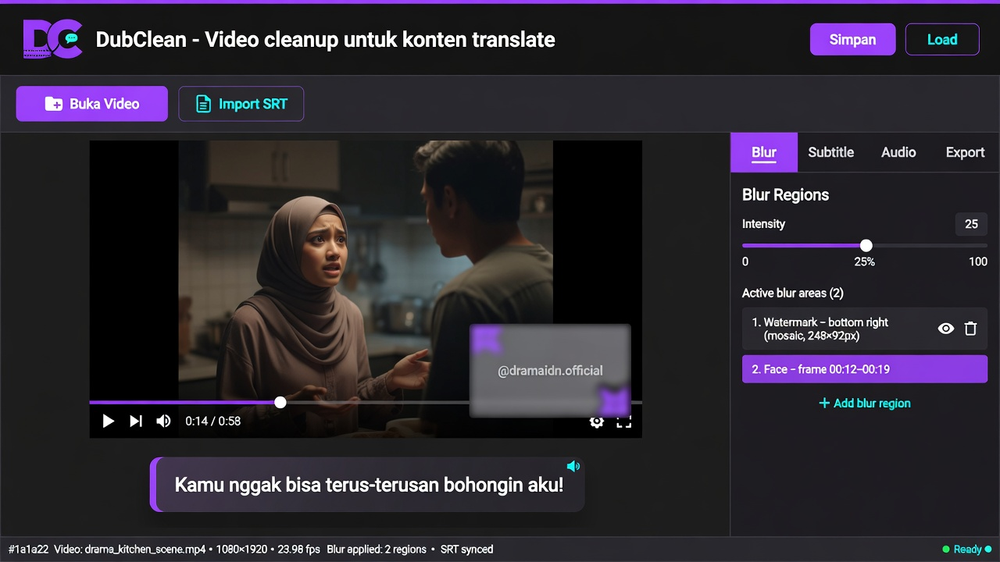

# DubClean

Desktop app (Electron) untuk membersihkan video hasil translate/repost — blur watermark, burn-in subtitle SRT, dan add/replace audio. Dibangun untuk produksi konten short video (drama China → Indonesia) secara lokal di laptop/PC.

**Repo:** https://github.com/OverHzn/DubClean



---

## Fitur

- **Preview Hasil** — render cuplikan pendek sebelum export penuh; hasil preview = hasil final (blur + subtitle + outline)
- **Blur region** — gambar kotak di preview untuk nutup watermark/teks asli (multi-box, koordinat %, intensitas adjustable, time range)
- **Burn-in subtitle** — import `.srt`, render dengan style box custom via ASS (font dinamis per resolusi, warna, posisi, opacity)
- **Add / Replace audio** — pasang audio baru (mp3/wav/aac/m4a) dengan kontrol volume, offset, trim/loop
- **Preset** — simpan/load template blur + subtitle style untuk series yang sama
- **Transport bar** — seek bar, waktu putar, **Space** putar/jeda, **E** toggle mode edit blur box
- **Player multi-aspect** — preview aspect ratio benar (vertical/horizontal/square), fullscreen (double-click / `F`)
- **Render lokal** — output `{nama}_clean.mp4` via ffmpeg (CRF 18)
- **Self-contained** — ffmpeg dibundle via `ffmpeg-static`, tidak perlu install ffmpeg manual

## Workflow

```
Buka video → gambar blur box → import SRT → atur style → Preview Hasil → Render Video
```

### Pipeline dengan SublyAI

```
SublyAI  →  transcribe + translate → download subtitle_id.srt
DubClean →  blur watermark + burn subtitle styled + add/replace audio → {nama}_clean.mp4
```

Generate SRT di [SublyAI](https://github.com/OverHzn/sublyai) (`outputs/<job_id>/subtitle_id.srt`), lalu import ke DubClean untuk finishing.

---

## Panduan Install

DubClean **self-contained** — ffmpeg sudah dibundle, tidak perlu install ffmpeg atau Node.js kalau pakai installer/portable.

### Kebutuhan sistem

| Platform | Minimum |
|----------|---------|
| Windows | Windows 10/11 64-bit |
| Linux | Distro modern 64-bit (AppImage) |
| RAM | 4 GB+ (8 GB disarankan untuk render video panjang) |
| Storage | ~200 MB untuk app + ruang untuk file output video |

---

### Opsi 1 — Download siap pakai (disarankan)

Cara termudah untuk end user — **tanpa Node.js, tanpa build manual**.

1. Buka **[GitHub Releases](https://github.com/OverHzn/DubClean/releases)**
2. Download file sesuai kebutuhan:

| File | Platform | Keterangan |
|------|----------|------------|
| `DubClean Setup 1.2.0.exe` | Windows | Installer NSIS — disarankan |
| `DubClean 1.2.0.exe` | Windows | Portable, tanpa install |
| `DubClean-1.2.0.AppImage` | Linux | Jalankan langsung, tanpa install |

3. Lanjut ke langkah install di bawah sesuai file yang kamu download.

> Belum ada release? Build dulu dari source — lihat [Opsi 4 — Build installer sendiri](#opsi-4--build-installer-sendiri).

---

### Opsi 2 — Windows (Installer)

Untuk pemakaian harian — app masuk Start Menu & bisa bikin shortcut desktop.

1. Download **`DubClean Setup 1.2.0.exe`** dari [Releases](https://github.com/OverHzn/DubClean/releases)
2. Double-click file installer
3. Kalau Windows SmartScreen muncul → klik **More info** → **Run anyway** (app belum di-sign)
4. Pilih folder install (default: `C:\Users\<nama>\AppData\Local\Programs\DubClean`)
5. Centang **Create desktop shortcut** kalau mau icon di desktop
6. Klik **Install** → tunggu selesai → **Finish**
7. Buka **DubClean** dari Start Menu atau shortcut desktop

**Setelah pertama kali buka:**

- Drag-drop video ke area preview, atau klik **Buka Video**
- Hasil render default tersimpan di folder `output/` di sebelah lokasi project (dev) atau folder yang kamu pilih di tab **Export**

**Uninstall:** Settings → Apps → DubClean → Uninstall, atau lewat **Add or Remove Programs**.

---

### Opsi 3 — Windows (Portable)

Cocok kalau mau jalanin dari USB / folder tanpa jejak di sistem.

1. Download **`DubClean 1.2.0.exe`** dari [Releases](https://github.com/OverHzn/DubClean/releases)
2. Pindahkan file ke folder mana saja (misal `D:\Tools\DubClean\`)
3. Double-click langsung — **tidak perlu install**
4. Bisa buat shortcut manual: klik kanan file → **Create shortcut**

> Portable menyimpan data app di `%LOCALAPPDATA%\DubClean` (userData), sama seperti versi installer.

---

### Opsi 4 — Linux (AppImage)

1. Download **`DubClean-1.2.0.AppImage`** dari [Releases](https://github.com/OverHzn/DubClean/releases)
2. Beri permission execute:

```bash
chmod +x DubClean-1.2.0.AppImage
```

3. Jalankan:

```bash
./DubClean-1.2.0.AppImage
```

Opsional — integrasi ke menu aplikasi:

```bash
# AppImageLauncher (kalau terpasang) biasanya auto-detect
# atau jalankan manual tiap kali
```

---

### Opsi 5 — Dari source (development)

Untuk kontribusi, debug, atau build sendiri.

**Requirements:** Node.js 18+, Git, Windows atau Linux

```bash
git clone https://github.com/OverHzn/DubClean.git
cd DubClean
npm install
npm start
```

Kalau `npm start` error `EBUSY` (umum di folder OneDrive):

```bash
npm run start:direct
```

Tips:

- Hindari clone di folder OneDrive/sync — bisa bikin file lock saat Electron jalan
- Lebih aman di path lokal, misal `C:\Dev\DubClean`

---

### Opsi 6 — Build installer sendiri

Kalau mau generate file `.exe` / AppImage dari source.

**Requirements:** Node.js 18+, npm

```bash
git clone https://github.com/OverHzn/DubClean.git
cd DubClean
npm install

# Windows — installer + portable
npm run build:win
# atau double-click build-app.bat
```

**Hasil build Windows:**

| File | Kegunaan |
|------|----------|
| `dist\DubClean Setup 1.2.0.exe` | Installer NSIS (~99 MB) |
| `dist\DubClean 1.2.0.exe` | Portable, tanpa install |
| `dist\win-unpacked\DubClean.exe` | Versi unpacked (debug) |

**Linux:**

```bash
npm run build:linux    # → dist/DubClean-1.2.0.AppImage
```

Installer memakai custom icon dari `build/icon.ico` / `build/icon.png` (bukan icon Electron default).

> Folder `dist/` tidak di-commit ke git — hasil build tetap lokal setelah build.

---

### Ringkasan — pilih yang mana?

| Kamu mau… | Pakai |
|-----------|-------|
| Pakai app cepat, tanpa ribet | **Opsi 1 + 2** — download installer |
| Jalanin dari USB / tanpa install | **Opsi 1 + 3** — portable |
| Pakai di Linux | **Opsi 1 + 4** — AppImage |
| Edit code / debug | **Opsi 5** — dari source |
| Bagi installer ke orang lain | **Opsi 6** — build sendiri, upload ke Releases |

---

## Struktur Project

```
DubClean/
├── build/
│   ├── icon.ico       # Windows app icon (installer + taskbar)
│   └── icon.png       # Linux AppImage icon
├── docs/
│   └── images/        # screenshot untuk README
├── src/
│   ├── main.js        # Electron main, IPC, ffmpeg render
│   ├── renderMath.js  # layout dinamis, koordinat ternormalisasi
│   ├── renderConfig.js # shared FFmpeg/ASS pipeline
│   ├── preload.js     # contextBridge API
│   ├── srtParser.js   # parser SRT
│   ├── index.html     # UI layout (sidebar tabs)
│   ├── style.css      # dark modern theme
│   └── renderer.js    # canvas editor, SRT, audio, preset, render
├── presets/           # preset JSON tersimpan
├── output/            # hasil render default ({nama}_clean.mp4)
├── build-app.bat      # rebuild installer Windows
├── package.json
├── PRD.md             # product requirements
├── PLAN.md            # technical plan
└── CLAUDE.md          # context untuk AI coding
```

---

## Cara Pakai

### Blur watermark

1. **Buka Video** — drag-drop atau file picker
2. Tab **Blur** → klik-drag di preview untuk gambar kotak di area watermark
3. Atur **Intensitas** (slider 1–50) — coba `25` untuk watermark kecil
4. (Opsional) **Mulai/Selesai** detik kalau watermark muncul-hilang
5. Bisa tambah lebih dari 1 box

### Subtitle

1. **Import SRT** di toolbar
2. Tab **Subtitle** → edit teks cue inline kalau perlu
3. Atur posisi, font size, warna, box opacity
4. **Render** → subtitle di-burn permanen ke video

### Audio

1. Tab **Audio** → **Import Audio**
2. Mode **Add** (video tanpa audio) atau **Replace** (ganti audio asli)
3. Atur volume, offset, trim/loop
4. **Render**

### Preset (series yang sama)

1. Atur blur + subtitle style (+ audio settings)
2. **Simpan** preset → file JSON
3. Video berikutnya → **Load** preset, ganti SRT (dan audio kalau perlu)

---

## Preset JSON

```json
{
  "preset_name": "drama_series_A",
  "blur_regions": [
    {
      "x": 1010, "y": 1210, "width": 150, "height": 90,
      "blur_intensity": 20,
      "time_range": { "start": 0, "end": null }
    }
  ],
  "subtitle_style": {
    "position": "bottom",
    "font_size": 42,
    "box_opacity": 0.6
  },
  "audio_settings": {
    "mode": "replace",
    "volume_percent": 100,
    "offset_seconds": 0,
    "fit_mode": "trim"
  }
}
```

> Path file audio **tidak** disimpan di preset — hanya `audio_settings`.

---

## Stack

- Electron + Vanilla JS + Canvas
- ffmpeg-static + fluent-ffmpeg
- Subtitle burn-in via ASS

## Troubleshooting

| Masalah | Solusi |
|---------|--------|
| Windows SmartScreen blokir installer | Klik **More info** → **Run anyway** — app belum code-signed |
| Installer/portable tidak jalan | Pastikan Windows 64-bit; coba run as Administrator sekali |
| `npm start` → `EBUSY` | Tutup app Electron lain, atau `npm run start:direct` |
| Project di OneDrive | Pindah ke `C:\Dev\DubClean` kalau file sering terkunci |
| Build gagal / `dist/` kosong | Pastikan `npm install` sukses; jalankan `npm run build:win` lagi |
| AppImage tidak execute (Linux) | `chmod +x DubClean-1.2.0.AppImage` |
| Render gagal | Pastikan video path valid, folder output ada, cek error di UI |
| Watermark masih kelihatan | Perbesar box atau naikkan intensitas blur |

## Roadmap (v1.2)

- Live CSS preview blur/subtitle di player (tanpa render FFmpeg)
- Audio mix (gabung audio asli + baru)
- VPS/headless CLI mode

## License

MIT — Owner: 0xHulk